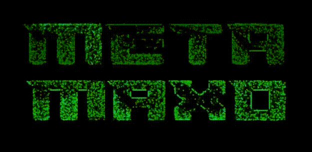

# Neo Oscilloscope



A WebAssembly-based audio visualizer built with Rust and JavaScript.

## Prerequisites

- [Rust](https://rustup.rs/)
- [wasm-pack](https://rustwasm.github.io/wasm-pack/installer/)

## Running the Application

1. **Build the WASM module:**
   ```bash
   ./build.sh
   ```

2. **Serve the application:**

   Navigate to the `app` directory and serve it with any static file server:
   ```bash
   cd app
   python -m http.server 8000
   ```

   Or use any other static file server like `npx serve`, `live-server`, etc.

3. **Open in browser:**

   Navigate to `http://localhost:8000` in your web browser.

## That's it!

The oscilloscope should now be running and ready to visualize audio.
